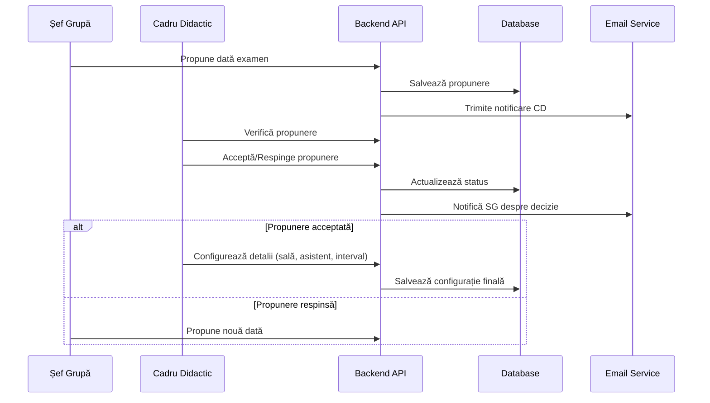
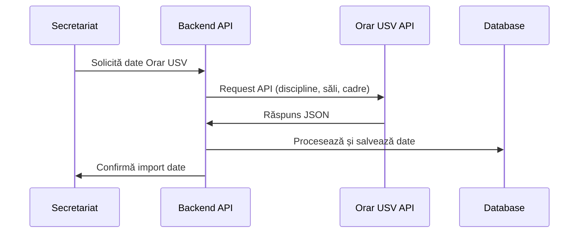

# Arhitectura Sistemului de Planificare Examene FIESC

## Prezentare generală

Sistemul de Planificare Examene FIESC este o aplicație web bazată pe arhitectura client-server, utilizând microservicii pentru a asigura scalabilitatea și mentenabilitatea codului. Aplicația este construită folosind tehnologii moderne și urmează principiile de dezvoltare software agile.

## Arhitectura generală

```
┌─────────────┐       ┌─────────────┐       ┌─────────────┐
│   Frontend  │◄─────►│   Backend   │◄─────►│  Database   │
│   (Vue.js)  │       │ (Flask/API) │       │(PostgreSQL) │
└─────────────┘       └──────┬──────┘       └─────────────┘
                             │
                             ▼
                      ┌─────────────┐
                      │  External   │
                      │   Services  │
                      └─────────────┘
                             │
                             ▼
                 ┌───────────────────────┐
                 │  - Orar USV API       │
                 │  - Email Service      │
                 │  - Google OAuth       │
                 └───────────────────────┘
```

## Componente principale

### 1. Frontend (Vue.js)

Frontend-ul este implementat utilizând Vue.js și oferă interfețe diferite pentru fiecare rol de utilizator:

- **Secretariat (SEC)**: Interfață pentru încărcarea datelor, configurarea perioadelor de examinare și exportul planificărilor
- **Șef Grupă (SG)**: Interfață pentru propunerea datelor de examen și vizualizarea statusului propunerilor
- **Cadru Didactic (CD)**: Interfață pentru validarea propunerilor și configurarea detaliilor de examinare
- **Administrator (ADM)**: Interfață pentru configurarea aplicației și gestionarea utilizatorilor

### 2. Backend (Flask/FastAPI)

Backend-ul este implementat utilizând Python cu Flask sau FastAPI și este organizat în următoarele module principale:

- **API**: Endpoint-uri REST pentru comunicarea cu frontend-ul
- **Services**: Logica de business a aplicației
- **Models**: Definirea modelelor de date și a relațiilor dintre ele
- **Integrations**: Integrări cu servicii externe (Orar USV, Email, Google OAuth)

### 2.1 Integrarea Flask și FastAPI

Sistemul utilizează ambele framework-uri (Flask și FastAPI) în mod complementar, fiecare fiind responsabil pentru componente specifice ale aplicației:

#### Flask
- **Interfața de administrare**: Gestionarea utilizatorilor, configurare sistem și dashboard-uri
- **Autentificare și sesiuni**: Implementarea fluxului de autentificare cu Google OAuth și gestionarea sesiunilor
- **Procesare formulare**: Gestionarea formularelor complexe pentru încărcarea datelor (Excel)
- **Generare rapoarte**: Exportul datelor în formate PDF și Excel
- **Integrare template-uri**: Randarea interfețelor pentru utilizatorii care nu folosesc SPA (Single Page Application)

#### FastAPI
- **API RESTful**: Endpoint-uri performante pentru comunicarea cu frontend-ul Vue.js
- **Validare date**: Validarea automată a datelor de intrare folosind Pydantic
- **Documentație API**: Generarea automată a documentației Swagger/OpenAPI
- **Asincronicitate**: Gestionarea operațiunilor asincrone (notificări, integrări externe)
- **WebSockets**: Comunicare în timp real pentru notificări și actualizări

#### Documentație API interactivă cu Swagger
O componentă esențială a sistemului este documentația API interactivă implementată cu Swagger UI, care permite:
- **Testare manuală** a tuturor endpoint-urilor API direct din browser
- **Explorare** a tuturor parametrilor și schemelor de date
- **Autentificare** și testare cu diferite roluri de utilizator
- **Vizualizare** a răspunsurilor și codurilor de eroare
- **Debugging** rapid al problemelor de integrare

FastAPI generează automat documentația Swagger, accesibilă la `/api/docs`, iar pentru endpoint-urile Flask se implementează manual documentația Swagger la `/api/docs/flask`.

#### Arhitectura de integrare
Cele două framework-uri sunt integrate folosind următoarea abordare:

1. **Gateway comun**: Un server Nginx care acționează ca proxy invers, direcționând cererile către serviciul corespunzător
2. **Partajare modele**: Modelele de date sunt definite într-un pachet comun, utilizat de ambele framework-uri
3. **Servicii partajate**: Logica de business este implementată în servicii independente de framework, care pot fi utilizate atât de Flask cât și de FastAPI
4. **Autentificare unificată**: Sistemul de autentificare este centralizat, permițând utilizatorilor să folosească aceleași credențiale pentru ambele componente

```
┌─────────────┐
│   Nginx     │
│   Gateway   │
└──────┬──────┘
       │
       ├─────────────┬─────────────┐
       │             │             │
┌──────▼──────┐┌─────▼─────┐┌──────▼──────┐
│  Flask App  ││ FastAPI   ││  Static     │
│ (Admin/UI)  ││ (REST API)││  Files      │
└──────┬──────┘└─────┬─────┘└─────────────┘
       │             │
       │             │
┌──────▼─────────────▼──────┐
│    Shared Services        │
│  (Business Logic Layer)   │
└──────┬─────────────┬──────┘
       │             │
┌──────▼──────┐┌─────▼─────┐
│ Database    ││ External  │
│ (PostgreSQL)││ Services  │
└─────────────┘└───────────┘
```

Această arhitectură permite:
- **Flexibilitate**: Utilizarea framework-ului potrivit pentru fiecare componentă
- **Scalabilitate**: Scalarea independentă a componentelor în funcție de necesități
- **Performanță**: Optimizarea fiecărei componente pentru cazul său de utilizare specific
- **Dezvoltare paralelă**: Echipe diferite pot lucra simultan pe componente diferite

### 3. Baza de date (PostgreSQL)

Baza de date stochează toate informațiile necesare pentru funcționarea aplicației, inclusiv:

- Utilizatori și roluri
- Discipline și programe de studiu
- Cadre didactice și șefi de grupă
- Săli disponibile
- Planificări examene și colocvii
- Notificări și istoricul modificărilor

## Schema bazei de date

Schema bazei de date este definită conform diagramei dbdiagram furnizate în caietul de sarcini:

```
Table users {
  id int [pk, increment]
  firstName varchar
  lastName varchar
  email varchar
  role varchar
  passwordHash varchar
}

Table subjects {
  id int [pk, increment]
  name varchar
  shortName varchar
  studyProgram varchar
  studyYear int
  groupId int [ref: > groups.id]
}

Table teachers {
  id int [pk, increment]
  firstName varchar
  lastName varchar
  email varchar
  department varchar
}

Table rooms {
  id int [pk, increment]
  name varchar
  shortName varchar
  buildingName varchar
  capacity int
  computers int
}

Table groups {
  id int [pk, increment]
  name varchar
  studyYear int
  specializationShortName varchar
}

Table schedules {
  id int [pk, increment]
  subjectId int [ref: > subjects.id]
  teacherId int [ref: > teachers.id]
  roomId int [ref: > rooms.id]
  groupId int [ref: > groups.id]
  date date
  startTime time
  endTime time
  status varchar
}

Table notifications {
  id int [pk, increment]
  userId int [ref: > users.id]
  message text
  dateSent datetime
  status varchar
}

Table excel_templates {
  id int [pk, increment]
  name varchar
  filePath varchar
  description text
}
```

## Fluxuri de date principale

### 1. Flux de planificare examen



### 2. Flux de integrare cu Orar USV



## Securitate

Sistemul implementează următoarele măsuri de securitate:

1. **Autentificare**: Utilizarea Google OAuth 2.0 pentru autentificare securizată
2. **Autorizare**: Control de acces bazat pe roluri (RBAC)
3. **Protecție date**: Criptarea parolelor și a datelor sensibile
4. **Validare input**: Validarea tuturor datelor de intrare pentru prevenirea atacurilor de tip injection
5. **HTTPS**: Comunicare criptată între client și server
6. **Rate limiting**: Limitarea numărului de cereri pentru prevenirea atacurilor de tip DoS

## Containerizare și deployment

Aplicația este containerizată utilizând Docker pentru a asigura portabilitatea și consistența mediilor de dezvoltare, testare și producție:

```
├── docker-compose.yml         # Configurare pentru mediul de producție
├── docker-compose.dev.yml     # Configurare pentru mediul de dezvoltare
├── Dockerfile.backend         # Imagine Docker pentru backend
├── Dockerfile.frontend        # Imagine Docker pentru frontend
└── Dockerfile.db              # Imagine Docker pentru baza de date
```

## Monitorizare și logging

Sistemul include mecanisme pentru monitorizarea performanței și detectarea erorilor:

1. **Logging**: Înregistrarea evenimentelor importante și a erorilor
2. **Metrics**: Colectarea de metrici de performanță
3. **Alerts**: Notificări automate în caz de erori critice

## Extensibilitate

Arhitectura sistemului este proiectată pentru a permite adăugarea facilă de noi funcționalități:

1. **Arhitectură modulară**: Componente independente care pot fi extinse separat
2. **API-uri bine definite**: Interfețe clare între componente
3. **Documentație completă**: Documentație detaliată pentru dezvoltatori
