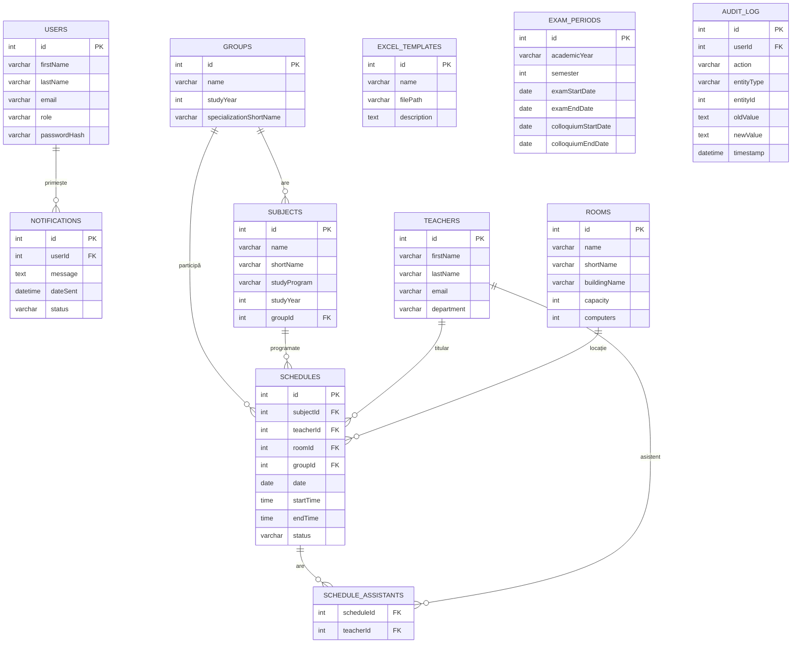

# Documentație Bază de Date - Sistem de Planificare Examene FIESC

## Prezentare generală

Baza de date a sistemului de planificare examene FIESC este implementată utilizând PostgreSQL și stochează toate informațiile necesare pentru funcționarea aplicației. Acest document descrie schema bazei de date, relațiile dintre tabele și constrângerile implementate.

## Schema bazei de date

Schema bazei de date este definită conform diagramei dbdiagram furnizate în caietul de sarcini:

```
Table users {
  id int [pk, increment]
  firstName varchar
  lastName varchar
  email varchar
  role varchar
  passwordHash varchar
}

Table subjects {
  id int [pk, increment]
  name varchar
  shortName varchar
  studyProgram varchar
  studyYear int
  groupId int [ref: > groups.id]
}

Table teachers {
  id int [pk, increment]
  firstName varchar
  lastName varchar
  email varchar
  department varchar
}

Table rooms {
  id int [pk, increment]
  name varchar
  shortName varchar
  buildingName varchar
  capacity int
  computers int
}

Table groups {
  id int [pk, increment]
  name varchar
  studyYear int
  specializationShortName varchar
}

Table schedules {
  id int [pk, increment]
  subjectId int [ref: > subjects.id]
  teacherId int [ref: > teachers.id]
  roomId int [ref: > rooms.id]
  groupId int [ref: > groups.id]
  date date
  startTime time
  endTime time
  status varchar
}

Table notifications {
  id int [pk, increment]
  userId int [ref: > users.id]
  message text
  dateSent datetime
  status varchar
}

Table excel_templates {
  id int [pk, increment]
  name varchar
  filePath varchar
  description text
}
```

## Descriere tabele

### 1. Tabelul `users`

Stochează informații despre utilizatorii sistemului.

| Coloană | Tip | Descriere |
|---------|-----|-----------|
| id | int | Identificator unic, cheie primară |
| firstName | varchar | Prenumele utilizatorului |
| lastName | varchar | Numele utilizatorului |
| email | varchar | Adresa de email (unică), utilizată pentru autentificare |
| role | varchar | Rolul utilizatorului (SEC, SG, CD, ADM) |
| passwordHash | varchar | Hash-ul parolei (doar pentru administrator) |

**Constrângeri:**
- Cheie primară: `id`
- Unicitate: `email`
- Valori permise pentru `role`: 'SEC', 'SG', 'CD', 'ADM'

### 2. Tabelul `subjects`

Stochează informații despre disciplinele de studiu.

| Coloană | Tip | Descriere |
|---------|-----|-----------|
| id | int | Identificator unic, cheie primară |
| name | varchar | Numele complet al disciplinei |
| shortName | varchar | Numele scurt al disciplinei (acronim) |
| studyProgram | varchar | Programul de studiu (ex. Calculatoare, Automatică) |
| studyYear | int | Anul de studiu |
| groupId | int | Referință către grupa asociată disciplinei |

**Constrângeri:**
- Cheie primară: `id`
- Cheie străină: `groupId` referențiază `groups.id`

### 3. Tabelul `teachers`

Stochează informații despre cadrele didactice.

| Coloană | Tip | Descriere |
|---------|-----|-----------|
| id | int | Identificator unic, cheie primară |
| firstName | varchar | Prenumele cadrului didactic |
| lastName | varchar | Numele cadrului didactic |
| email | varchar | Adresa de email instituțională (@usv.ro) |
| department | varchar | Departamentul din care face parte |

**Constrângeri:**
- Cheie primară: `id`
- Unicitate: `email`

### 4. Tabelul `rooms`

Stochează informații despre sălile disponibile pentru examinare.

| Coloană | Tip | Descriere |
|---------|-----|-----------|
| id | int | Identificator unic, cheie primară |
| name | varchar | Numele complet al sălii |
| shortName | varchar | Numele scurt al sălii |
| buildingName | varchar | Numele clădirii în care se află sala |
| capacity | int | Capacitatea sălii (număr de locuri) |
| computers | int | Numărul de calculatoare disponibile în sală |

**Constrângeri:**
- Cheie primară: `id`
- Unicitate: combinația `buildingName` și `shortName`

### 5. Tabelul `groups`

Stochează informații despre grupele de studenți.

| Coloană | Tip | Descriere |
|---------|-----|-----------|
| id | int | Identificator unic, cheie primară |
| name | varchar | Numele grupei (ex. 3A2) |
| studyYear | int | Anul de studiu |
| specializationShortName | varchar | Acronimul specializării |

**Constrângeri:**
- Cheie primară: `id`
- Unicitate: `name`

### 6. Tabelul `schedules`

Stochează informații despre planificările examenelor și colocviilor.

| Coloană | Tip | Descriere |
|---------|-----|-----------|
| id | int | Identificator unic, cheie primară |
| subjectId | int | Referință către disciplina examinată |
| teacherId | int | Referință către cadrul didactic titular |
| roomId | int | Referință către sala de examinare |
| groupId | int | Referință către grupa examinată |
| date | date | Data examinării |
| startTime | time | Ora de început |
| endTime | time | Ora de sfârșit |
| status | varchar | Statusul planificării (proposed, approved, rejected) |

**Constrângeri:**
- Cheie primară: `id`
- Chei străine:
  - `subjectId` referențiază `subjects.id`
  - `teacherId` referențiază `teachers.id`
  - `roomId` referențiază `rooms.id`
  - `groupId` referențiază `groups.id`
- Valori permise pentru `status`: 'proposed', 'approved', 'rejected'
- Verificare: `startTime` < `endTime`

### 7. Tabelul `notifications`

Stochează notificările trimise utilizatorilor.

| Coloană | Tip | Descriere |
|---------|-----|-----------|
| id | int | Identificator unic, cheie primară |
| userId | int | Referință către utilizatorul destinatar |
| message | text | Conținutul notificării |
| dateSent | datetime | Data și ora trimiterii notificării |
| status | varchar | Statusul notificării (read, unread) |

**Constrângeri:**
- Cheie primară: `id`
- Cheie străină: `userId` referențiază `users.id`
- Valori permise pentru `status`: 'read', 'unread'

### 8. Tabelul `excel_templates`

Stochează informații despre template-urile Excel utilizate pentru importul și exportul datelor.

| Coloană | Tip | Descriere |
|---------|-----|-----------|
| id | int | Identificator unic, cheie primară |
| name | varchar | Numele template-ului |
| filePath | varchar | Calea către fișierul template |
| description | text | Descrierea scopului și structurii template-ului |

**Constrângeri:**
- Cheie primară: `id`
- Unicitate: `name`

## Tabele adiționale (propuse pentru îmbunătățirea sistemului)

### 9. Tabelul `schedule_assistants`

Tabel de legătură pentru a stoca asistenții asociați unei planificări (relație many-to-many între `schedules` și `teachers`).

```
Table schedule_assistants {
  scheduleId int [ref: > schedules.id]
  teacherId int [ref: > teachers.id]
  primary key (scheduleId, teacherId)
}
```

### 10. Tabelul `exam_periods`

Stochează informații despre perioadele de examinare.

```
Table exam_periods {
  id int [pk, increment]
  academicYear varchar
  semester int
  examStartDate date
  examEndDate date
  colloquiumStartDate date
  colloquiumEndDate date
}
```

### 11. Tabelul `audit_log`

Stochează informații despre modificările efectuate în sistem pentru audit.

```
Table audit_log {
  id int [pk, increment]
  userId int [ref: > users.id]
  action varchar
  entityType varchar
  entityId int
  oldValue text
  newValue text
  timestamp datetime
}
```

## Indecși

Pentru optimizarea performanței, se recomandă crearea următorilor indecși:

1. `users_email_idx` pe `users.email`
2. `schedules_date_idx` pe `schedules.date`
3. `schedules_status_idx` pe `schedules.status`
4. `notifications_userId_status_idx` pe `notifications.userId` și `notifications.status`
5. `schedules_composite_idx` pe `schedules.date`, `schedules.roomId`, `schedules.startTime`, `schedules.endTime`

## Diagrama relațională



## Migrații

Pentru gestionarea evoluției schemei bazei de date, se recomandă utilizarea unui sistem de migrații (ex. Alembic pentru Python). Migrațiile vor fi stocate în directorul `migrations/` și vor fi rulate automat la lansarea aplicației.

## Backup și Restaurare

Se recomandă configurarea unui sistem automat de backup pentru baza de date, cu următoarele caracteristici:

1. Backup zilnic complet
2. Retenție backup-uri: 30 de zile
3. Backup-urile vor fi stocate în locații separate de serverul de producție

Procedura de restaurare va fi documentată în detaliu în fișierul `OPERATIONS.md`.

## Performanță și Optimizare

Pentru asigurarea performanței optime a bazei de date, se recomandă:

1. Utilizarea indecșilor menționați anterior
2. Configurarea adecvată a parametrilor PostgreSQL (shared_buffers, work_mem, etc.)
3. Implementarea unui mecanism de caching pentru datele accesate frecvent
4. Monitorizarea regulată a performanței și optimizarea query-urilor lente
